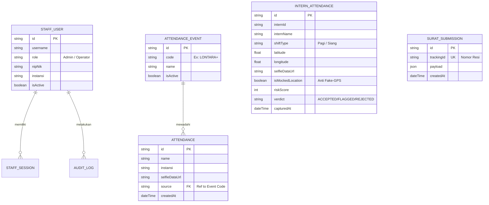
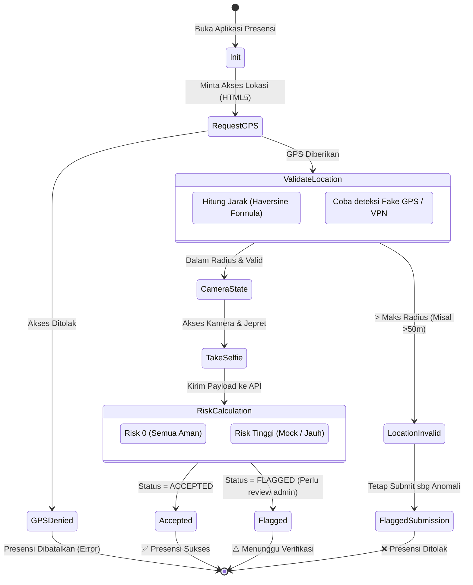
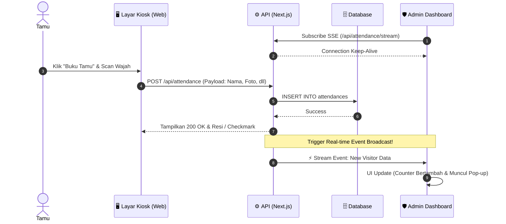

# 🏛️ Blueprint & Architecture: Diskominfo Guestbook & Internal Ecosystem

Dokumen ini adalah **Rancangan Arsitektur dan Perencanaan (Blueprint)** untuk ekosistem aplikasi Diskominfo yang mencakup:
1. **Guestbook (Buku Tamu Lobi)**
2. **Surat Elektronik (E-Surat)**
3. **Intern Attendance (Presensi Magang berbasis Geofence)**

> [!TIP]
> **Cara Merender / Melihat Visualisasi File Ini:**
> Karena Anda sedang berada di dalam VS Code (melihat dari file yang sedang terbuka), Anda bisa langsung menekan tombol **`Ctrl + Shift + V`** (Windows) atau klik kanan tab file ini lalu pilih **"Open Preview"**. VS Code secara native mendukung render *Markdown* dan grafik *Mermaid*!

---

## 1. 🏗️ Arsitektur Sistem (C4 Context Model)

Diagram di bawah ini memvisualisasikan arsitektur *top-level* dari sistem, menunjukkan aktor utama dan bagaimana mereka berinteraksi dengan layanan yang ada.

```mermaid
flowchart TD
    %% Styling
    classDef user fill:#f9f9f9,stroke:#333,stroke-width:2px;
    classDef system fill:#e1f5fe,stroke:#0288d1,stroke-width:2px;
    classDef db fill:#ffecb3,stroke:#ffa000,stroke-width:2px;

    %% Actors
    Tamu([👤 Publik / Tamu]):::user
    Intern([🎓 Anak Magang]):::user
    Admin([🛡️ Resepsionis & Admin]):::user

    %% Core System
    subgraph Core Ecosystem [Diskominfo Internal App System]
        direction TB
        WebApp["💻 Web Application \n(Next.js App Router)\n- Kiosk Tamu\n- Form Surat\n- Admin Dashboard"]:::system
        MobileInterface["📱 Mobile Web/App \n(Geofencing UI)\n- Selfie Capture\n- GPS Tracker"]:::system
        API["⚙️ Serverless API \n(Next.js Route Handlers)\n- Validation\n- Real-time SSE"]:::system
    end

    %% External & DB
    DB[(🗄️ PostgreSQL\nvia Prisma)]:::db
    LocalStorage[("💾 Browser Storage\n(State Prototipe)")]:::db

    %% Interactions
    Tamu -->|1. Isi Kehadiran & Kirim Surat| WebApp
    Intern -->|2. Check-in (Selfie & GPS)| MobileInterface
    Admin -->|3. Monitor Dashboard, Validasi| WebApp

    WebApp -->|HTTP / SSE| API
    MobileInterface -->|HTTP POST| API
    
    API <-->|Prisma ORM| DB
    WebApp -.->|Temp workflow data| LocalStorage
```

---

## 2. 🗃️ Entity Relationship Diagram (ERD)

Berikut adalah struktur skema *Database* relasional yang di-deploy menggunakan Prisma ORM.



---

## 3. 🛤️ User Journeys & State Diagram

### A. Alur Presensi Anak Magang (Geofencing Tracker)
Ini adalah alur aplikasi *Mobile* untuk memvalidasi presensi anak magang berbasis geofence secara ketat.



### B. Alur Kiosk Tamu & Real-time Admin Dashboard


---

## 4. 🎨 Rancangan UI/UX & Aesthetics (Mockup Terstruktur)

Rancangan di bawah menggunakan pendekatan *Glassmorphism* dan dominasi desain bertema **Bold & Premium** (sesuai arahan *Aesthetic Guidelines* proyek).

### 📱 4.1. Mobile Application: Layar Presensi Magang
*(Implementasi difokuskan pada fungsional, tegas, namun elegan dengan mode gelap/terang adaptif)*

> [!NOTE]
> **Vibe / Tema UI**: *Cyber-Minimalist* dengan efek transparan. Latar belakang gelap (Dark Mode) dipadukan dengan aksen *Neon Green/Blue* pada indikator lokasi yang valid.

*Struktur Wireframe Mobile:*
```text
+------------------------------------------+
|  [ ☰ ] Diskominfo Intern             [⚙] |
|------------------------------------------|
|                                          |
|  Budi Santoso                            |
|  Frontend Engineering Intern             |
|                                          |
|  [========= STATUS GEOFENCE =========]   |
|  | 🟢 Dalam Area Identifikasi        |   |
|  | 🎯 Akurasi: 5 meter                 |   |
|  | 📍 Lat: -1.23, Long: 119.8          |   |
|  [===================================]   |
|                                          |
|  +------------------------------------+  |
|  |                                    |  |
|  |        [ LIVE CAMERA FEED ]        |  |
|  |                                    |  |
|  |                                    |  |
|  +------------------------------------+  |
|                                          |
|  [        🟢 CHECK-IN SEKARANG        ]  |
|   (Tombol berdenyut/glowing jika valid)  |
|                                          |
|  Riwayat Hari Ini:                       |
|  - Check-in  : 07:55 AM (Verifikasi ✅)  |
|  - Check-out : ---                       |
+------------------------------------------+
```

### 💻 4.2. Admin Dashboard: Intake & Monitoring
*(Implementasi berfokus pada kepadatan data namun tidak berantakan. Warna didominasi putih/krem untuk kebersihan, dengan font sans-serif khusus seperti `Inter` atau `Outfit`)*

> [!TIP]
> **Vibe / Tema UI**: *Editorial & Dashboard Pro*. Tidak banyak warna solid norak, pemisahan menggunakan *White Space* dan garis tipis minimalis (Borders `1px solid #eaeaea`).

*Struktur Wireframe Dashboard:*
```text
+-------------------------------------------------------------------------+
| [Logo Diskominfo] |  Dashboard   Intake (2)   Surat (5)   Magang   ⚙️     |
+-------------------------------------------------------------------------+
|                                                                         |
|  PULSE OVERVIEW (LIVE)                             Kamis, 15 Maret 2026 |
|  +--------------+  +--------------+  +--------------+  +--------------+ |
|  | Tamu Hari Ini|  | Surat Masuk  |  | Magang Hadir |  | Status Server| |
|  | 145 Ppl      |  | 12 Dokumen   |  | 28/30 Ppl    |  | 🟢 Online    | |
|  +--------------+  +--------------+  +--------------+  +--------------+ |
|                                                                         |
|  [ ⚡ LIVE ATTENDANCE STREAM ]           [ ⚠️ FLAG PRESENSI MAGANG ]      |
|  ---------------------------------      ------------------------------- |
|  Bapak Andi - Kominfo                   [REJECT] Budi - Fake GPS (🔴)   |
|  Masuk 10:25 AM | ✅ Berhasil             10:00 AM | Score: 95/100      |
|                                                                         |
|  Ibu Rini - Kemenkeu                    [FLAGGED] Tiara - Out of Zone   |
|  Masuk 10:20 AM | ✅ Berhasil             09:55 AM | Jarak: 200m        |
|                                                                         |
+-------------------------------------------------------------------------+
```

---

## 5. 🚀 Roadmap Eksekusi (Next Steps)

Langkah strategis dari fase prototipe saat ini menuju produksi rilis akhir:

| Phase | Milestone Name | Status Target | Deskripsi Pekerjaan |
| :--- | :--- | :---: | :--- |
| **P1** | **Backend Realization** | 🚧 60% | Memindahkan State (*Surat*, *Visitor*, *Staff*) dari `localStorage` browser ke tabel PostgreSQL (Prisma). |
| **P2** | **Intern System (Geofence)** | ⏳ TBA | Membangun UI Mobile-first untuk capture titik koordinat GPS dan *Selfie* kamera dengan `react-webcam`. |
| **P3** | **Anti-Fraud Security** | ⏳ TBA | Implementasi algoritma pendeteksi manipulasi GPS (*Mock Location*) dan Haversine Calculator untuk toleransi jarak. |
| **P4** | **Premium UI Refactor** | ⏳ TBA | Membuang standar *Tailwind* membosankan; memasukkan font kustom, *Framer Motion* enter-animations, dan tata letak eksklusif. |

---
> *Generated by Antigravity Blueprint Engine.*
