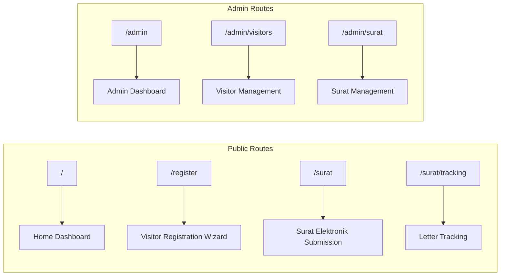
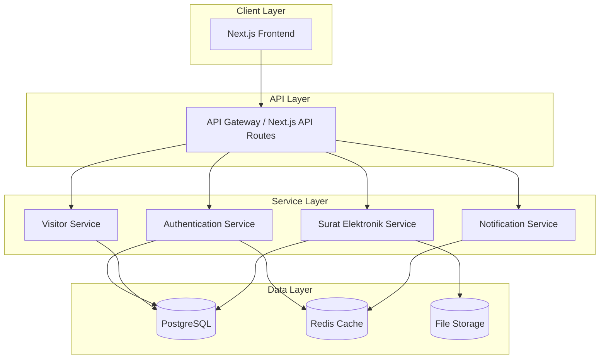
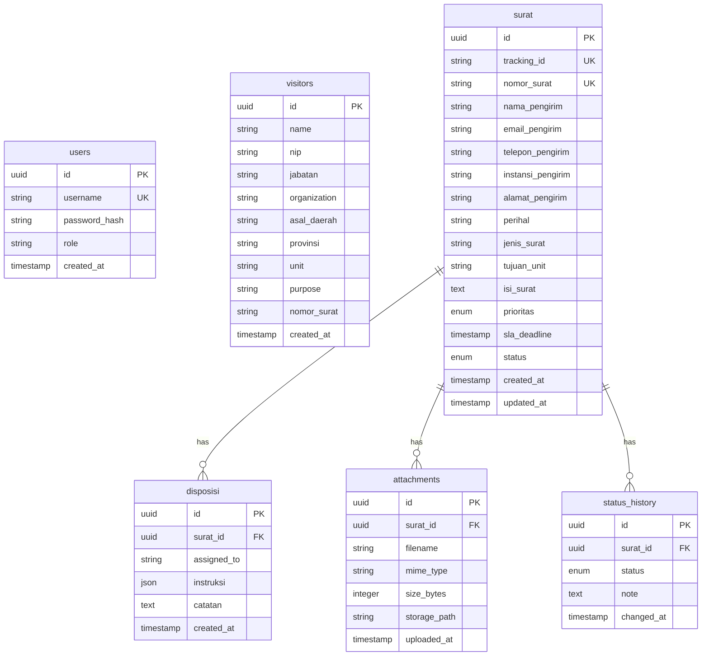

# Backend Architecture Planning Document
## Diskominfo Guestbook Application

This document provides a comprehensive backend architecture analysis and planning recommendations for future implementation.

---

## 1. Current State Analysis

### Technology Stack
| Layer | Technology | Version |
|-------|-----------|---------|
| Framework | Next.js | 16.1.1 |
| UI Library | React | 19.2.3 |
| Styling | Tailwind CSS | 4.x |
| Language | TypeScript | 5.x |
| Data Persistence | localStorage | Browser API |

### Application Routes



### Data Models

#### Visitor Entity
```typescript
interface Visitor {
    id: string;           // UUID
    name: string;         // Full name
    nip: string;          // NIP (government employee ID)
    jabatan: string;      // Position/title
    organization: string; // Organization/institution
    asalDaerah: string;   // Origin region
    provinsi: string;     // Province
    unit: string;         // Target unit
    purpose: string;      // Visit purpose
    nomorSurat: string;   // Letter number reference
    timestamp: string;    // Time of registration
    date: string;         // Date of registration
}
```

#### Surat Elektronik Entity
```typescript
interface SuratElektronik {
    id: string;                    // UUID
    trackingId: string;            // TRK-YYYY-MM-XXXX
    nomorSurat: string;            // Official letter number
    namaPengirim: string;          // Sender name
    emailPengirim: string;         // Sender email
    teleponPengirim: string;       // Sender phone
    instansiPengirim: string;      // Sender institution
    alamatPengirim: string;        // Sender address
    perihal: string;               // Subject
    jenisSurat: string;            // Letter type
    tujuanUnit: string;            // Target unit
    isiSurat: string;              // Letter content
    lampiran: Attachment[];        // Attachments
    prioritas: "tinggi" | "normal" | "rendah";
    slaDeadline: string;           // SLA deadline
    disposisi?: Disposisi;         // Assignment info
    responseNote?: string;         // Admin response
    status: "submitted" | "received" | "processing" | "completed" | "archived";
    statusHistory: StatusChange[]; // Audit trail
    timestamp: string;
    date: string;
    lastUpdated: string;
}
```

### Current Architecture Limitations

> ⚠️ **Critical Issues**

1. **No Backend Persistence** - All data stored in browser localStorage
2. **No Authentication System** - Hardcoded admin credentials
3. **No API Layer** - Direct localStorage manipulation
4. **No File Storage** - Attachments stored as base64 in localStorage

---

## 2. Proposed Backend Architecture

### Service Boundaries



### API Design (RESTful)

#### Authentication Endpoints
| Method | Endpoint | Description |
|--------|----------|-------------|
| POST | `/api/auth/login` | Admin login |
| POST | `/api/auth/logout` | Admin logout |
| GET | `/api/auth/session` | Get current session |

#### Visitor Endpoints
| Method | Endpoint | Description |
|--------|----------|-------------|
| GET | `/api/visitors` | List visitors (paginated) |
| POST | `/api/visitors` | Create new visitor registration |
| GET | `/api/visitors/:id` | Get visitor by ID |
| GET | `/api/visitors/stats` | Get visitor statistics |
| GET | `/api/visitors/export` | Export to CSV |

#### Surat Elektronik Endpoints
| Method | Endpoint | Description |
|--------|----------|-------------|
| GET | `/api/surat` | List surat (paginated, filtered) |
| POST | `/api/surat` | Submit new surat |
| GET | `/api/surat/:id` | Get surat by ID |
| GET | `/api/surat/tracking/:trackingId` | Public tracking lookup |
| PATCH | `/api/surat/:id/status` | Update surat status |
| POST | `/api/surat/:id/disposisi` | Assign disposisi |
| PATCH | `/api/surat/:id/priority` | Update priority |
| GET | `/api/surat/stats` | Get surat statistics |

### Database Schema



---

## 3. Authentication & Authorization

### JWT-Based Authentication
- **Access Token**: Short-lived (15 minutes)
- **Refresh Token**: Long-lived (7 days), httpOnly cookie
- **Session validation**: Redis-cached

### Role-Based Access Control (RBAC)
| Role | Permissions |
|------|-------------|
| `super_admin` | Full system access |
| `admin` | Surat & visitor management |
| `operator` | Read-only + status updates |
| `public` | Tracking lookup only |

---

## 4. Technology Recommendations

| Component | Recommended | Alternative |
|-----------|-------------|-------------|
| Database | PostgreSQL | SQLite, Supabase |
| ORM | Drizzle ORM | Prisma |
| File Storage | Local FS / MinIO | Cloudflare R2 |
| Cache | Redis | In-memory |
| Auth | Custom JWT | NextAuth.js |

---

## 5. Proposed File Structure

```
src/
├── app/
│   ├── api/
│   │   ├── auth/
│   │   │   ├── login/route.ts
│   │   │   ├── logout/route.ts
│   │   │   └── session/route.ts
│   │   ├── visitors/
│   │   │   ├── route.ts
│   │   │   ├── [id]/route.ts
│   │   │   ├── stats/route.ts
│   │   │   └── export/route.ts
│   │   ├── surat/
│   │   │   ├── route.ts
│   │   │   ├── [id]/route.ts
│   │   │   ├── tracking/[trackingId]/route.ts
│   │   │   └── stats/route.ts
│   │   └── health/route.ts
├── lib/
│   ├── db/
│   │   ├── schema.ts
│   │   ├── client.ts
│   │   └── migrations/
│   ├── auth/
│   │   ├── jwt.ts
│   │   ├── session.ts
│   │   └── middleware.ts
│   ├── services/
│   │   ├── visitorService.ts
│   │   └── suratService.ts
│   └── validators/
│       ├── visitorSchema.ts
│       └── suratSchema.ts
```

---

## 6. Migration Strategy

| Phase | Duration | Scope |
|-------|----------|-------|
| **Phase 1** | Week 1 | Database setup, schema, migrations |
| **Phase 2** | Week 2-3 | API routes, validation, error handling |
| **Phase 3** | Week 3-4 | JWT auth, session management, RBAC |
| **Phase 4** | Week 4 | File storage for attachments |
| **Phase 5** | Week 5 | Frontend migration to API calls |

---

## 7. Dependencies to Install

```bash
# Production
npm install drizzle-orm postgres dotenv zod jose

# Development
npm install -D drizzle-kit
```

---

*Document created: 2026-02-04*
