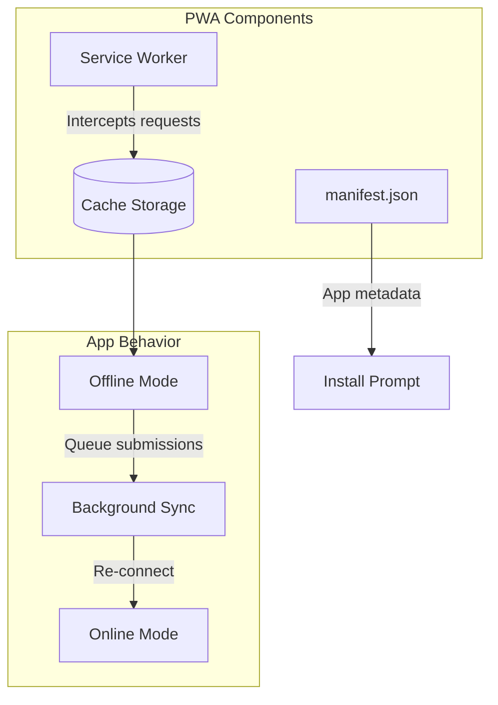

# PWA (Progressive Web App) Implementation Plan
## Diskominfo Guestbook Application

This document outlines the implementation plan for converting the guestbook app into a Progressive Web App for offline capability and native-like experience.

---

## 1. Overview

### What PWA Enables

| Capability | Benefit for Guestbook |
|------------|----------------------|
| **Installable** | Install on kiosk without app store |
| **Offline Mode** | Form works without internet |
| **Fullscreen** | No browser UI, professional look |
| **Fast Loading** | Cached assets load instantly |
| **Background Sync** | Submit forms when back online |

### Cost: **Rp 0** (configuration only)

---

## 2. Architecture



---

## 3. Implementation Steps

### Step 1: Install next-pwa

```bash
npm install next-pwa
```

### Step 2: Create manifest.json

Location: `public/manifest.json`

```json
{
  "name": "Buku Tamu Diskominfo",
  "short_name": "Buku Tamu",
  "description": "Sistem Buku Tamu Digital Diskominfo",
  "start_url": "/",
  "display": "standalone",
  "background_color": "#0f172a",
  "theme_color": "#3b82f6",
  "orientation": "portrait",
  "icons": [
    {
      "src": "/icons/icon-192.png",
      "sizes": "192x192",
      "type": "image/png",
      "purpose": "any maskable"
    },
    {
      "src": "/icons/icon-512.png",
      "sizes": "512x512",
      "type": "image/png",
      "purpose": "any maskable"
    }
  ]
}
```

### Step 3: Configure next.config.ts

```typescript
import withPWA from "next-pwa";

const config = withPWA({
  dest: "public",
  register: true,
  skipWaiting: true,
  disable: process.env.NODE_ENV === "development",
  runtimeCaching: [
    {
      urlPattern: /^https:\/\/fonts\.(?:gstatic|googleapis)\.com\/.*/i,
      handler: "CacheFirst",
      options: {
        cacheName: "google-fonts",
        expiration: { maxEntries: 10, maxAgeSeconds: 365 * 24 * 60 * 60 },
      },
    },
    {
      urlPattern: /\.(?:png|jpg|jpeg|svg|gif|webp|ico)$/i,
      handler: "CacheFirst",
      options: {
        cacheName: "images",
        expiration: { maxEntries: 50, maxAgeSeconds: 30 * 24 * 60 * 60 },
      },
    },
    {
      urlPattern: /\/_next\/static\/.*/i,
      handler: "CacheFirst",
      options: {
        cacheName: "next-static",
        expiration: { maxEntries: 100, maxAgeSeconds: 365 * 24 * 60 * 60 },
      },
    },
  ],
});

export default config;
```

### Step 4: Add Meta Tags to layout.tsx

```tsx
<head>
  <link rel="manifest" href="/manifest.json" />
  <meta name="theme-color" content="#3b82f6" />
  <meta name="apple-mobile-web-app-capable" content="yes" />
  <meta name="apple-mobile-web-app-status-bar-style" content="black-translucent" />
  <link rel="apple-touch-icon" href="/icons/icon-192.png" />
</head>
```

### Step 5: Create App Icons

Required sizes:
| Size | File | Purpose |
|------|------|---------|
| 192x192 | `icon-192.png` | Android/Chrome |
| 512x512 | `icon-512.png` | Splash screen |
| 180x180 | `apple-touch-icon.png` | iOS |

---

## 4. Offline Functionality

### Offline Form Submission

```typescript
// lib/offlineQueue.ts
interface QueuedSubmission {
  id: string;
  type: "visitor" | "surat";
  data: object;
  timestamp: string;
}

const QUEUE_KEY = "offline_submissions";

export function queueSubmission(type: string, data: object) {
  const queue = getQueue();
  queue.push({
    id: crypto.randomUUID(),
    type,
    data,
    timestamp: new Date().toISOString(),
  });
  localStorage.setItem(QUEUE_KEY, JSON.stringify(queue));
}

export function getQueue(): QueuedSubmission[] {
  const data = localStorage.getItem(QUEUE_KEY);
  return data ? JSON.parse(data) : [];
}

export async function syncQueue() {
  const queue = getQueue();
  for (const item of queue) {
    try {
      await fetch(`/api/${item.type}`, {
        method: "POST",
        body: JSON.stringify(item.data),
      });
      removeFromQueue(item.id);
    } catch {
      // Keep in queue, retry later
    }
  }
}
```

### Network Status Detection

```typescript
// hooks/useOnlineStatus.ts
import { useState, useEffect } from "react";

export function useOnlineStatus() {
  const [isOnline, setIsOnline] = useState(true);

  useEffect(() => {
    setIsOnline(navigator.onLine);
    
    const handleOnline = () => setIsOnline(true);
    const handleOffline = () => setIsOnline(false);
    
    window.addEventListener("online", handleOnline);
    window.addEventListener("offline", handleOffline);
    
    return () => {
      window.removeEventListener("online", handleOnline);
      window.removeEventListener("offline", handleOffline);
    };
  }, []);

  return isOnline;
}
```

---

## 5. Kiosk Mode Setup

### Chrome Kiosk Mode (Windows)

```batch
"C:\Program Files\Google\Chrome\Application\chrome.exe" ^
  --kiosk ^
  --app=https://guestbook.diskominfo.go.id ^
  --disable-pinch ^
  --overscroll-history-navigation=0
```

### Android Kiosk Mode

1. Install PWA via Chrome → "Add to Home Screen"
2. Use Android's Screen Pinning feature
3. Or use dedicated kiosk launcher app

---

## 6. File Structure

```
public/
├── manifest.json
├── icons/
│   ├── icon-192.png
│   ├── icon-512.png
│   └── apple-touch-icon.png
├── sw.js (auto-generated)
src/
├── lib/
│   └── offlineQueue.ts
├── hooks/
│   └── useOnlineStatus.ts
```

---

## 7. Testing Checklist

| Test | How to Verify |
|------|---------------|
| Installable | Chrome DevTools → Application → Manifest |
| Offline works | DevTools → Network → Offline checkbox |
| Icons appear | Install app, check home screen |
| Fullscreen | Open installed app, no browser UI |
| Form queuing | Submit offline, check localStorage |
| Auto-sync | Go online, check queue cleared |

---

## 8. Implementation Timeline

| Task | Duration |
|------|----------|
| Install next-pwa + config | 15 min |
| Create manifest.json | 10 min |
| Generate app icons | 15 min |
| Add meta tags | 5 min |
| Offline queue logic | 30 min |
| Testing | 30 min |
| **Total** | **~2 hours** |

---

## 9. Lighthouse PWA Checklist

Run: Chrome DevTools → Lighthouse → Progressive Web App

| Requirement | Status |
|-------------|--------|
| HTTPS | ⬜ Required for production |
| Service Worker | ⬜ Auto-generated by next-pwa |
| Web App Manifest | ⬜ manifest.json |
| Responsive | ✅ Already implemented |
| Offline Page | ⬜ Fallback page |
| 200 when offline | ⬜ Cached pages |

---

*Document created: 2026-02-04*
