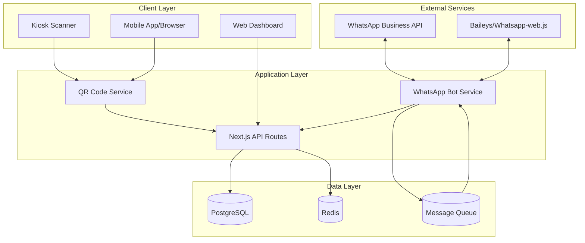
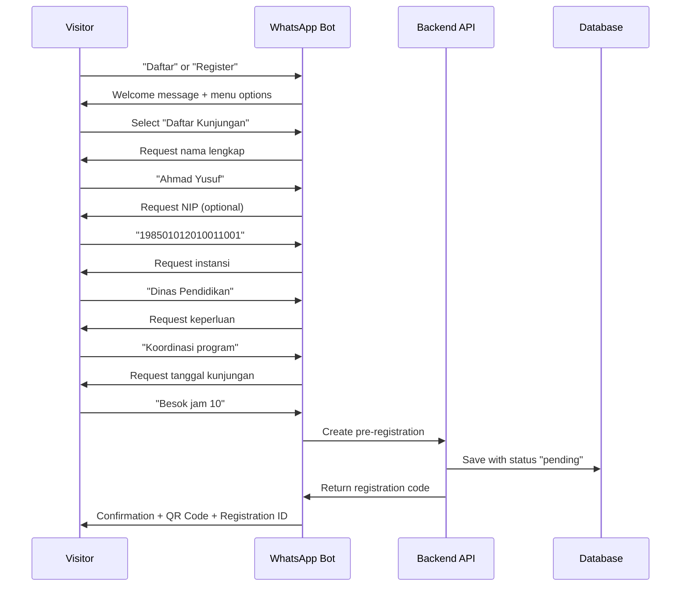
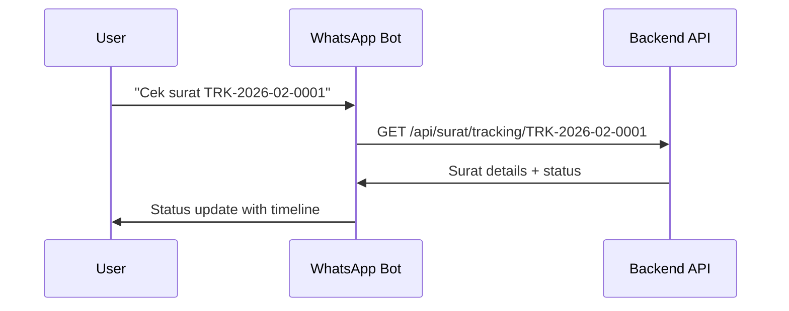
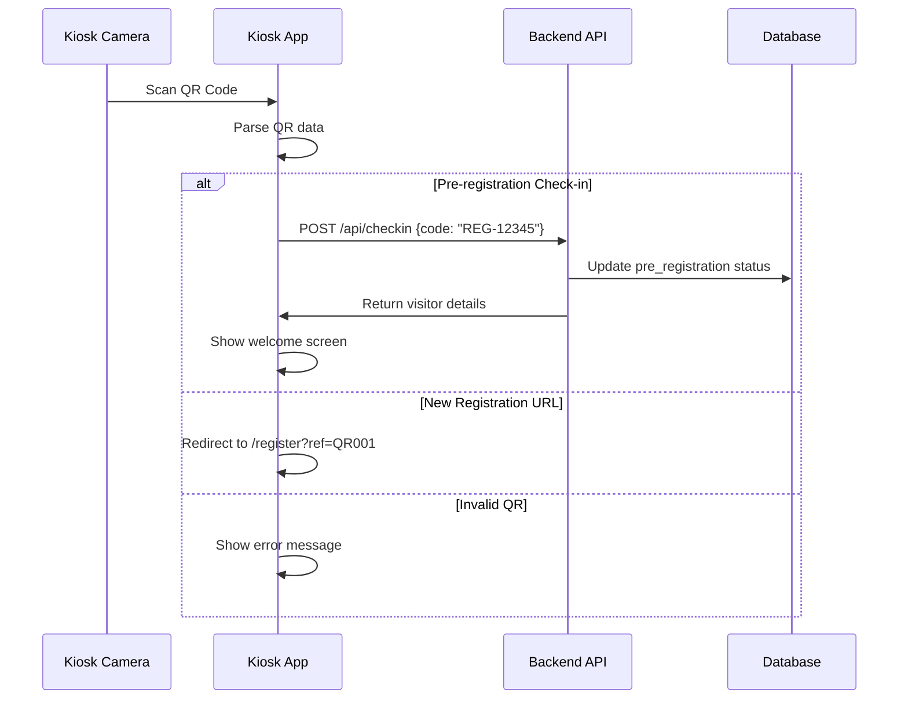
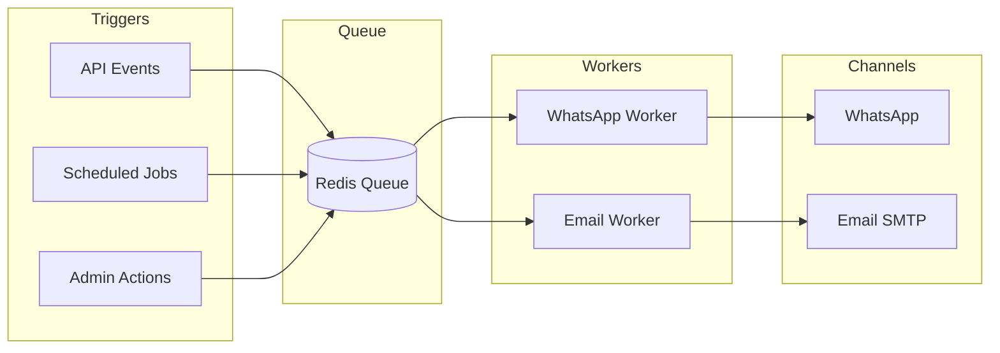

# WhatsApp Bot & QR Code Integration Plan
## Diskominfo Guestbook Application

This document outlines the architecture and implementation plan for WhatsApp bot integration and QR code-based visitor registration.

---

## 1. Feature Overview

### WhatsApp Bot Features
- **Visitor Pre-registration** - Guests can register before arrival via WhatsApp
- **Appointment Scheduling** - Book visit time slots
- **Surat Status Notifications** - Automated updates on letter processing
- **Tracking Lookup** - Check surat status via WhatsApp message
- **Queue Management** - Get queue number and estimated wait time

### QR Code Features
- **Self-Service Check-in** - Scan QR at kiosk to complete registration
- **Pre-registration Link** - QR codes that open registration form
- **Digital Receipt** - QR code on receipt for visitor verification
- **Surat Tracking** - QR code linking to tracking page

---

## 2. System Architecture



---

## 3. WhatsApp Bot Implementation

### 3.1 Technology Options

| Option | Type | Cost | Pros | Cons |
|--------|------|------|------|------|
| **WhatsApp Business API** | Official | Paid | Reliable, scalable, verified | Requires Meta approval, costs |
| **Baileys** | Unofficial | Free | Free, full features | May break, ToS risk |
| **whatsapp-web.js** | Unofficial | Free | Easy setup, good docs | Session management, ToS risk |

**Recommendation**: Start with `whatsapp-web.js` for development/POC, migrate to official API for production.

### 3.2 Bot Message Flows

#### Visitor Pre-registration Flow


#### Surat Tracking Flow


### 3.3 Bot Commands

| Command | Description | Example |
|---------|-------------|---------|
| `menu` / `help` | Show available commands | "menu" |
| `daftar` | Start visitor registration | "daftar" |
| `cek [tracking_id]` | Check surat status | "cek TRK-2026-02-0001" |
| `antrian` | Check current queue | "antrian" |
| `batal [reg_id]` | Cancel pre-registration | "batal REG-12345" |
| `info` | Office information | "info" |

### 3.4 API Endpoints for Bot

| Method | Endpoint | Description |
|--------|----------|-------------|
| POST | `/api/bot/webhook` | WhatsApp webhook receiver |
| POST | `/api/bot/pre-register` | Create pre-registration |
| GET | `/api/bot/queue-status` | Get current queue info |
| POST | `/api/bot/send-notification` | Send status notification |

### 3.5 Database Schema Additions

```sql
-- Pre-registrations table
CREATE TABLE pre_registrations (
    id UUID PRIMARY KEY,
    registration_code VARCHAR(20) UNIQUE,
    phone_number VARCHAR(20),
    name VARCHAR(255),
    nip VARCHAR(50),
    organization VARCHAR(255),
    purpose TEXT,
    scheduled_date DATE,
    scheduled_time TIME,
    status VARCHAR(20) DEFAULT 'pending', -- pending, confirmed, checked_in, cancelled, expired
    qr_code_data TEXT,
    created_at TIMESTAMP DEFAULT NOW(),
    expires_at TIMESTAMP,
    checked_in_at TIMESTAMP
);

-- Bot sessions table (for conversation state)
CREATE TABLE bot_sessions (
    id UUID PRIMARY KEY,
    phone_number VARCHAR(20) UNIQUE,
    current_state VARCHAR(50),
    context JSONB,
    last_interaction TIMESTAMP,
    created_at TIMESTAMP DEFAULT NOW()
);

-- Notification queue
CREATE TABLE notification_queue (
    id UUID PRIMARY KEY,
    phone_number VARCHAR(20),
    message_type VARCHAR(50),
    message_content TEXT,
    reference_id UUID,
    status VARCHAR(20) DEFAULT 'pending',
    scheduled_at TIMESTAMP,
    sent_at TIMESTAMP,
    created_at TIMESTAMP DEFAULT NOW()
);
```

---

## 4. QR Code Implementation

### 4.1 QR Code Types

| Type | Content | Use Case |
|------|---------|----------|
| **Registration URL** | `https://guestbook.diskominfo.go.id/register?ref=QR001` | Posted at entrance |
| **Pre-registration Check-in** | `CHECKIN:REG-12345` | Sent via WhatsApp |
| **Digital Receipt** | `VISITOR:abc-123-def` | Shown on success screen |
| **Surat Tracking** | `https://guestbook.diskominfo.go.id/surat/tracking/TRK-2026-02-0001` | Printed on receipt |

### 4.2 QR Code Generation

```typescript
// Using qrcode.react (already installed)
interface QRCodeConfig {
    type: "url" | "checkin" | "visitor" | "tracking";
    data: string;
    size?: number;
    includeMargin?: boolean;
}

// Example QR data formats
const QR_FORMATS = {
    registration: (refCode: string) => 
        `${BASE_URL}/register?ref=${refCode}`,
    checkin: (regId: string) => 
        `CHECKIN:${regId}`,
    visitor: (visitorId: string) => 
        `VISITOR:${visitorId}`,
    tracking: (trackingId: string) => 
        `${BASE_URL}/surat/tracking/${trackingId}`,
};
```

### 4.3 QR Code Scanner Integration

#### Kiosk Scanner Flow


### 4.4 Scanner API Endpoints

| Method | Endpoint | Description |
|--------|----------|-------------|
| POST | `/api/checkin` | Process QR check-in |
| GET | `/api/qr/validate/:code` | Validate QR code |
| POST | `/api/qr/generate` | Generate new QR code |

### 4.5 Frontend Scanner Component

```typescript
// Scanner component props
interface QRScannerProps {
    onScan: (data: string) => void;
    onError: (error: Error) => void;
    facingMode?: "user" | "environment";
    scanDelay?: number;
}

// Recommended library: @yudiel/react-qr-scanner or html5-qrcode
```

---

## 5. Notification System

### 5.1 Notification Types

| Event | Channel | Message |
|-------|---------|---------|
| Pre-registration confirmed | WhatsApp | QR code + appointment details |
| Surat received | WhatsApp + Email | Tracking ID + status |
| Surat status change | WhatsApp | New status + next steps |
| SLA warning | WhatsApp (Admin) | Overdue surat alert |
| Queue update | WhatsApp | Current position + ETA |

### 5.2 Notification Service Architecture



---

## 6. Proposed File Structure

```
src/
├── app/
│   ├── api/
│   │   ├── bot/
│   │   │   ├── webhook/route.ts      # WhatsApp webhook
│   │   │   ├── pre-register/route.ts
│   │   │   └── send-notification/route.ts
│   │   ├── checkin/route.ts          # QR check-in
│   │   └── qr/
│   │       ├── generate/route.ts
│   │       └── validate/[code]/route.ts
│   └── ...
├── lib/
│   ├── whatsapp/
│   │   ├── client.ts                 # WhatsApp client setup
│   │   ├── handlers/
│   │   │   ├── menuHandler.ts
│   │   │   ├── registrationHandler.ts
│   │   │   └── trackingHandler.ts
│   │   ├── templates/
│   │   │   ├── welcome.ts
│   │   │   ├── confirmation.ts
│   │   │   └── statusUpdate.ts
│   │   └── session.ts                # Conversation state
│   ├── qr/
│   │   ├── generator.ts
│   │   ├── parser.ts
│   │   └── validator.ts
│   └── notifications/
│       ├── queue.ts
│       ├── whatsappWorker.ts
│       └── emailWorker.ts
├── components/
│   ├── QRScanner.tsx
│   ├── QRDisplay.tsx
│   └── CheckInScreen.tsx
```

---

## 7. Dependencies

```bash
# WhatsApp Integration
npm install whatsapp-web.js qrcode-terminal

# QR Code Scanner (for kiosk)
npm install @yudiel/react-qr-scanner
# or
npm install html5-qrcode

# QR Code Generation (already have qrcode.react)
# Already installed: qrcode.react

# Background Jobs
npm install bullmq ioredis
```

---

## 8. Implementation Phases

| Phase | Duration | Scope |
|-------|----------|-------|
| **Phase 1** | Week 1 | QR code generation for receipts + tracking URLs |
| **Phase 2** | Week 2 | QR scanner component for kiosk |
| **Phase 3** | Week 2-3 | WhatsApp bot setup (whatsapp-web.js) |
| **Phase 4** | Week 3-4 | Pre-registration flow via WhatsApp |
| **Phase 5** | Week 4 | Automated notifications system |
| **Phase 6** | Week 5 | Admin dashboard for bot monitoring |

---

## 9. Security Considerations

| Concern | Mitigation |
|---------|------------|
| QR code tampering | Sign QR data with HMAC, validate on scan |
| Rate limiting | Limit bot messages per phone number |
| Session hijacking | Expire bot sessions after 15 min inactivity |
| Webhook validation | Verify WhatsApp webhook signatures |
| Data privacy | Don't store full phone numbers, hash for lookup |

---

## 10. Integration with Existing System

### Visitor Registration Enhancement
```typescript
// Enhanced visitor interface
interface Visitor {
    // ... existing fields
    registrationType: "walk-in" | "pre-registered" | "qr-scan";
    preRegistrationId?: string;
    whatsappNumber?: string;
    qrCodeId?: string;
}
```

### Surat Enhancement
```typescript
// Enhanced surat interface  
interface SuratElektronik {
    // ... existing fields
    notifyWhatsApp: boolean;
    whatsappNumber?: string;
    lastNotificationSent?: string;
}
```

---

*Document created: 2026-02-04*
